# Task-7-python-sqlite-analysis
**Task 7 - Basic Sales Analysis using Python and SQLite.**


# 📊 Task 7: Python + SQLite Sales Analysis

> Internship Project - ElevateLabs (1 Month Unpaid)

## 📝 Task Objective

The objective of Task 7 was to perform a basic sales summary using Python and SQLite. The process involved:
- Creating a SQLite database
- Running SQL queries using Python
- Displaying outputs using print statements
- Visualizing results using matplotlib
- Saving visual outputs as images

---

## 🧰 Tools Used

- Python
- SQLite (via sqlite3)
- Pandas
- Matplotlib
- Jupyter Notebook

---

## 📁 Folder Structure

```
D:\INTERNSHIP\ELEVATELABS - INTERN (1 Month - unpaid)\TASK - 7\
│
├── sales_data.db
├── Task_7_sales_summary.ipynb
├── sales_chart.png
├── TASK 7 DA.pdf
├── README.md
├── images/
│   ├── Q1..jpg
│   ├── Q2..jpg
│   ├── ...
```

---

## ✅ Task Execution & Outputs

### 📌 New Database Created
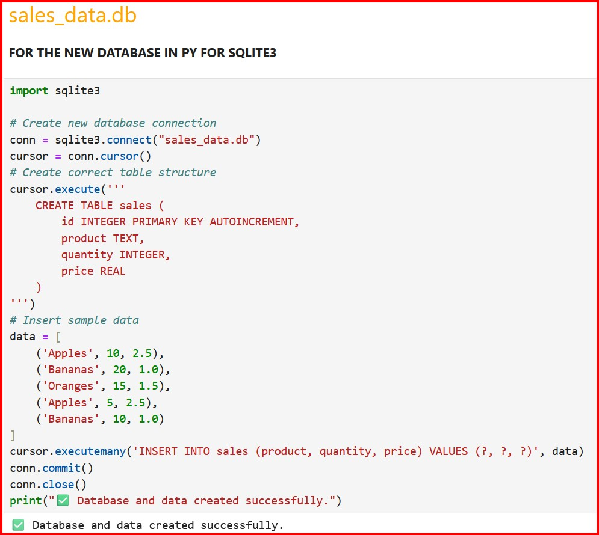

---

### 📌 Q1 - View All Sales Data
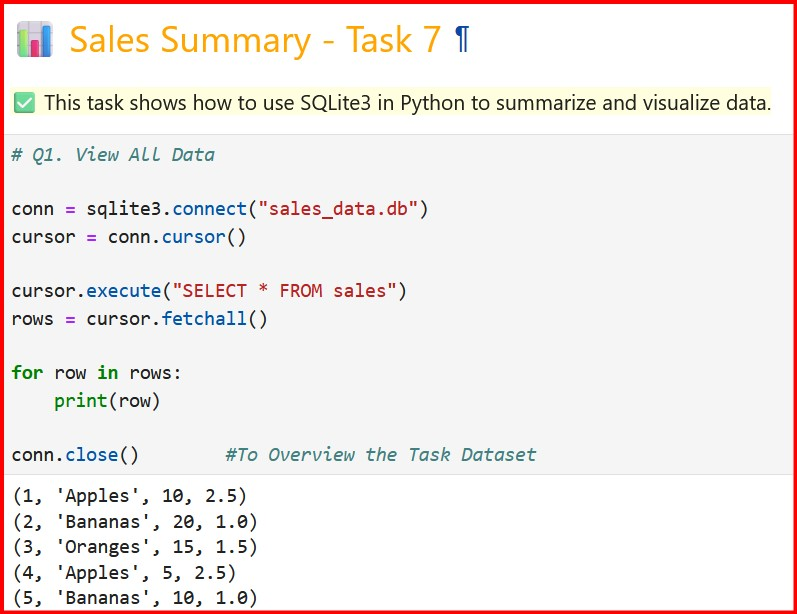

---

### 📌 Q2 - Unique Products
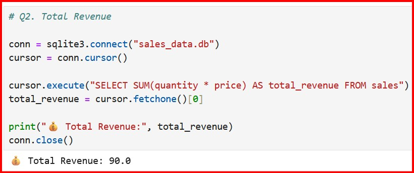

---

### 📌 Q3 - Total Revenue
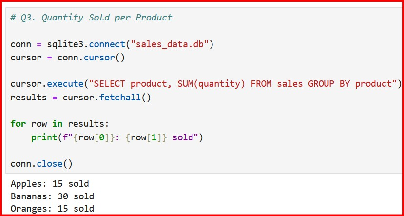

---

### 📌 Q4 - Product Revenue Summary
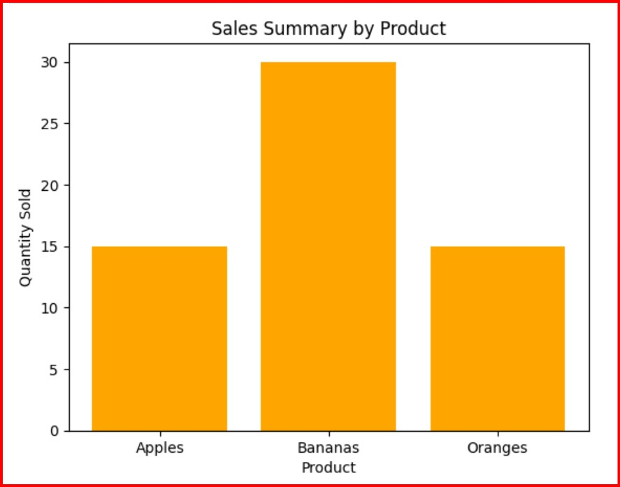
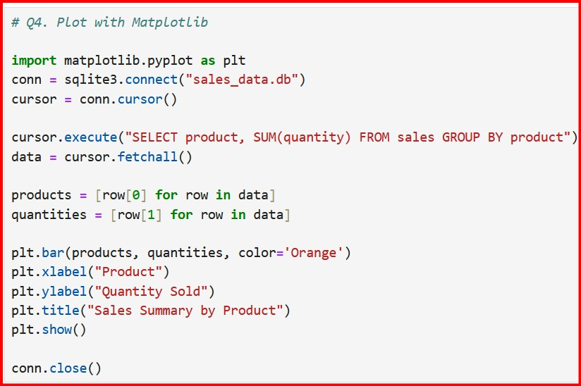

---

### 📌 Q5 - Total Orders by Product
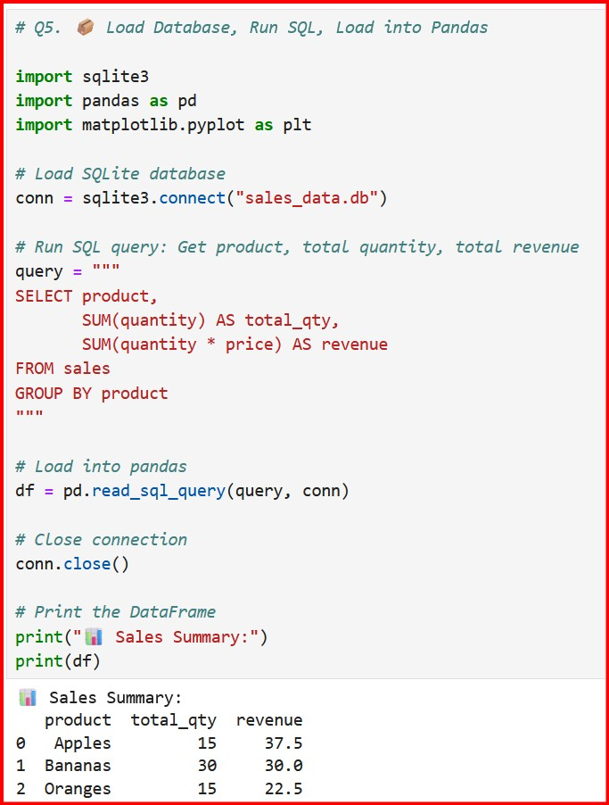

---

### 📌 Q6 - Average Quantity or Price
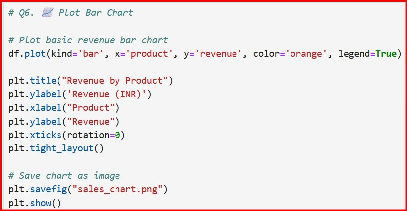
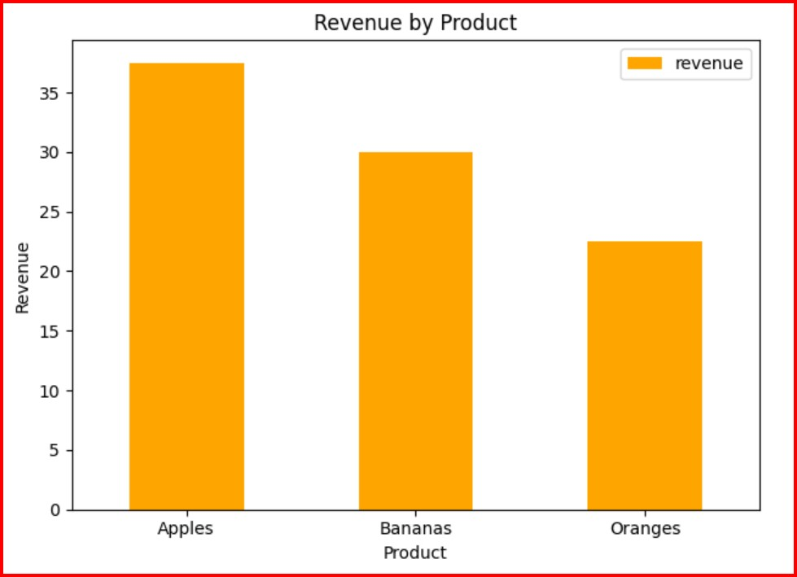

---

### 📌 Q7 - Monthly Revenue Visualization
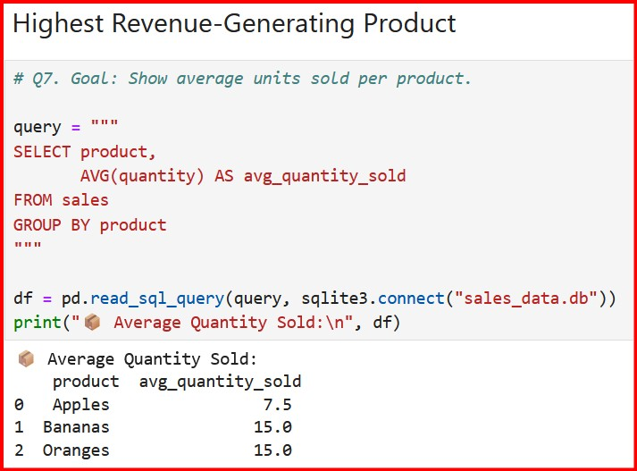

---

### 📌 Q8 - Total Quantity Sold per Product
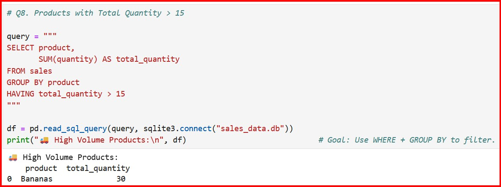

---

### 📌 Q9 - High Volume Products
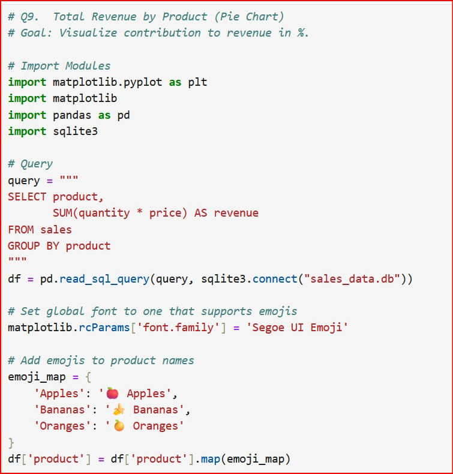
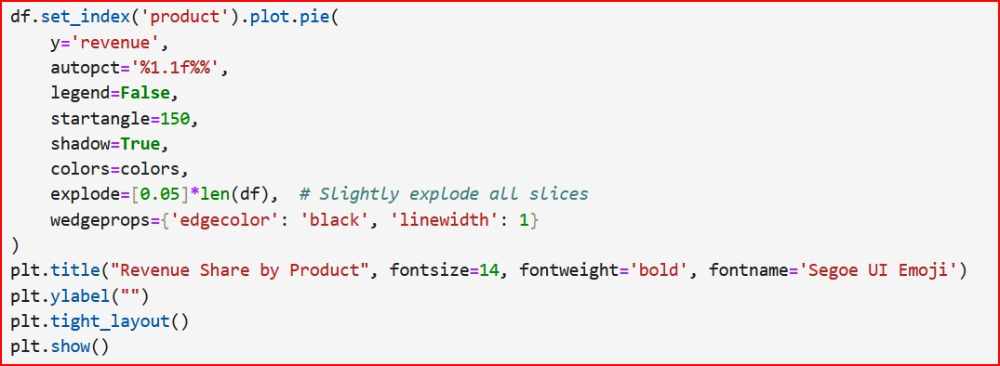
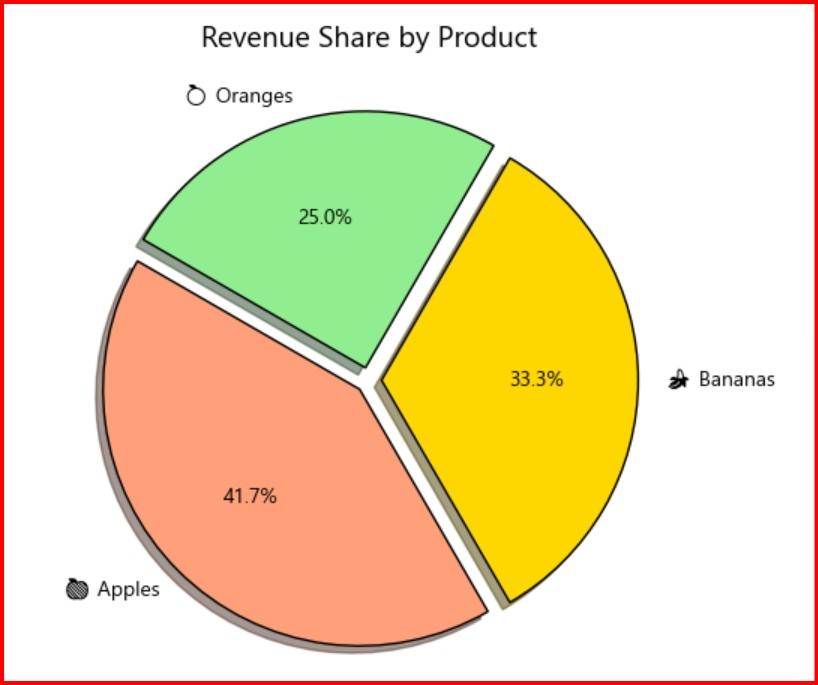

---

### 📌 Q10 - Top Selling Product by Revenue
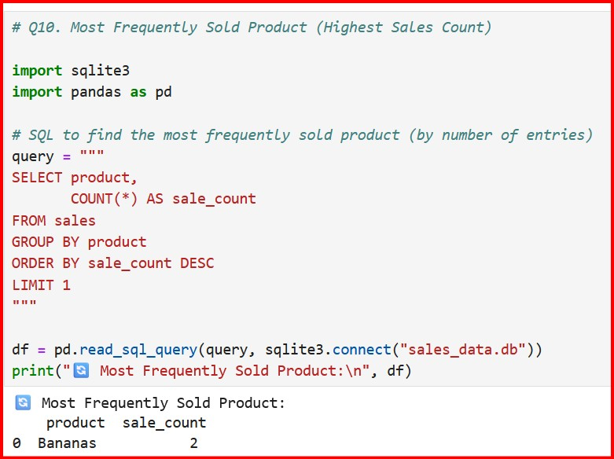

---

## 💬 Interview Questions & Answers

**Q1. How did you connect Python to a database?**  
→ Using the `sqlite3.connect("sales_data.db")` command to connect to the SQLite database.

**Q2. What SQL query did you run?**  
→ Queries like total revenue, average quantity, and monthly revenue using `SELECT`, `GROUP BY`, and aggregation functions.

**Q3. What does GROUP BY do?**  
→ It groups rows by a column (e.g., product or date) to apply aggregate functions like SUM or COUNT per group.

**Q4. How did you calculate revenue?**  
→ By multiplying `quantity * price` inside SQL queries and summing them for each product.

**Q5. How did you visualize the result?**  
→ Using `matplotlib.pyplot` to create bar and line plots of revenue trends.

**Q6. What does pandas do in your code?**  
→ It helps load SQL results into a DataFrame using `pd.read_sql_query()` and makes data manipulation easier.

**Q7. What’s the benefit of using SQL inside Python?**  
→ It allows combining SQL’s querying power with Python’s analytical and visualization features.

**Q8. Could you run the same SQL query directly in DB Browser for SQLite?**  
→ Yes, all SQL queries used in Python can be run in any SQLite editor like DB Browser.

---

## 🙋‍♂️ Author

[👨‍💻 Mihir Sonar](https://www.linkedin.com/in/mihir-sonar-2287041bb)

[](https://www.linkedin.com/in/mihir-sonar-2287041bb)

---

✅ Task 7 Completed Successfully – with full analysis, visual outputs, and interview preparation.
